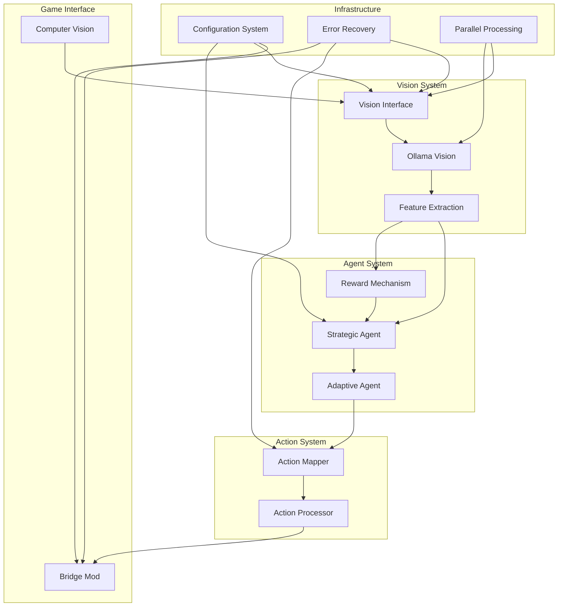
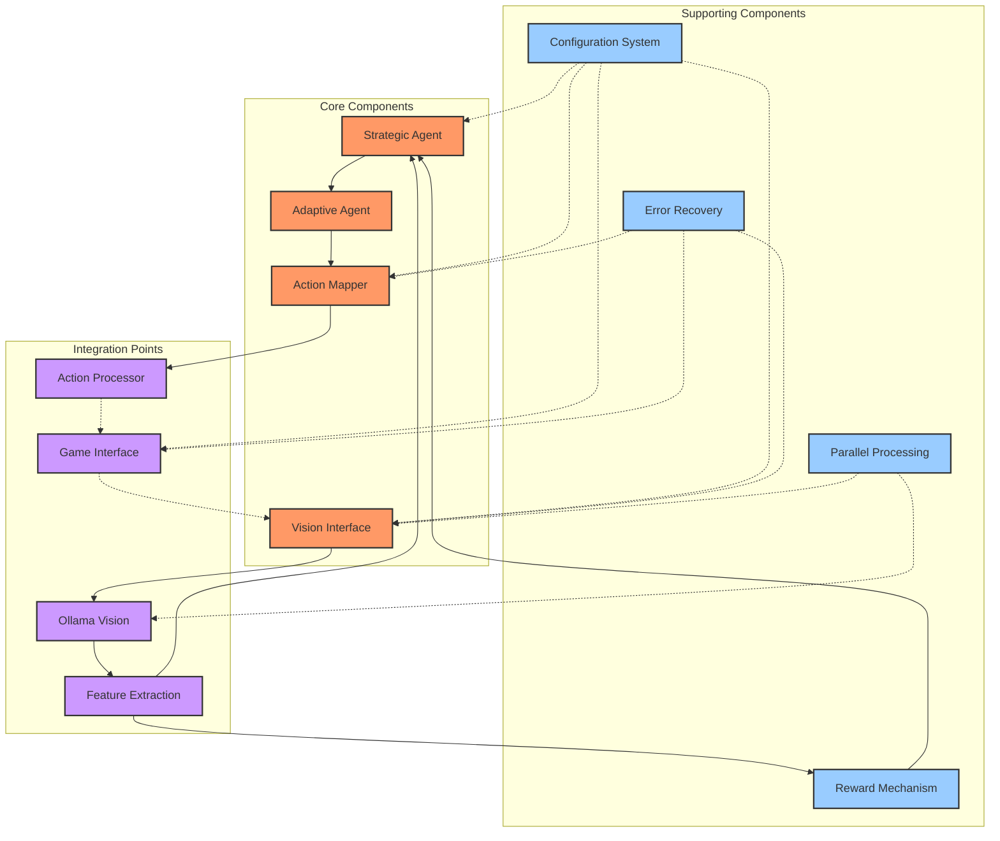
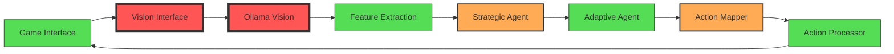
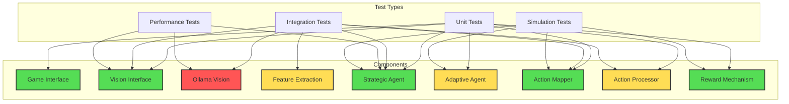

# Component Relationship Visualization

**Tags:** #architecture #integration #visualization #summary

## Overview
This document provides visual representations of the relationships between various components of the CS2 reinforcement learning agent system using Mermaid diagrams.

## High-Level System Architecture

## Data Flow Diagram

```mermaid
flowchart LR
    GI[Game Interface] --> |Raw Screenshots| VI[Vision Interface]
    VI --> |Processed Images| OV[Ollama Vision]
    OV --> |Scene Understanding| FE[Feature Extraction]
    FE --> |Game State Features| RM[Reward Mechanism]
    FE --> |Game State Features| SA[Strategic Agent]
    RM --> |Reward Signals| SA
    SA --> |Strategic Decisions| AA[Adaptive Agent]
    AA --> |Mode-specific Actions| AM[Action Mapper]
    AM --> |Game Commands| AP[Action Processor]
    AP --> |Executable Actions| GI
    
    style GI fill:#f9d,stroke:#333,stroke-width:2px
    style VI fill:#bbf,stroke:#333,stroke-width:2px
    style OV fill:#bbf,stroke:#333,stroke-width:2px
    style FE fill:#bbf,stroke:#333,stroke-width:2px
    style RM fill:#bfb,stroke:#333,stroke-width:2px
    style SA fill:#bfb,stroke:#333,stroke-width:2px
    style AA fill:#bfb,stroke:#333,stroke-width:2px
    style AM fill:#fbb,stroke:#333,stroke-width:2px
    style AP fill:#fbb,stroke:#333,stroke-width:2px
```

## Component Dependencies

## Performance Bottlenecks

## Testing Coverage

## How to Use These Diagrams

The diagrams above provide different views of the system:

1. **High-Level System Architecture** - Shows the major subsystems and their relationships
2. **Data Flow Diagram** - Illustrates how data flows through the system from game interface to actions
3. **Component Dependencies** - Highlights which components depend on others
4. **Performance Bottlenecks** - Identifies the performance-critical components
5. **Testing Coverage** - Shows the test coverage across different components

These visualizations complement the written analyses and provide a quick understanding of system structure and relationships.

## Related Documents
- [Comprehensive Architecture](../architecture/comprehensive_architecture.md)
- [Component Integration](../architecture/component_integration.md)
- [Performance Profiling Overview](../performance/performance_profiling.md)
- [Testing Infrastructure](../testing/testing_infrastructure.md) 